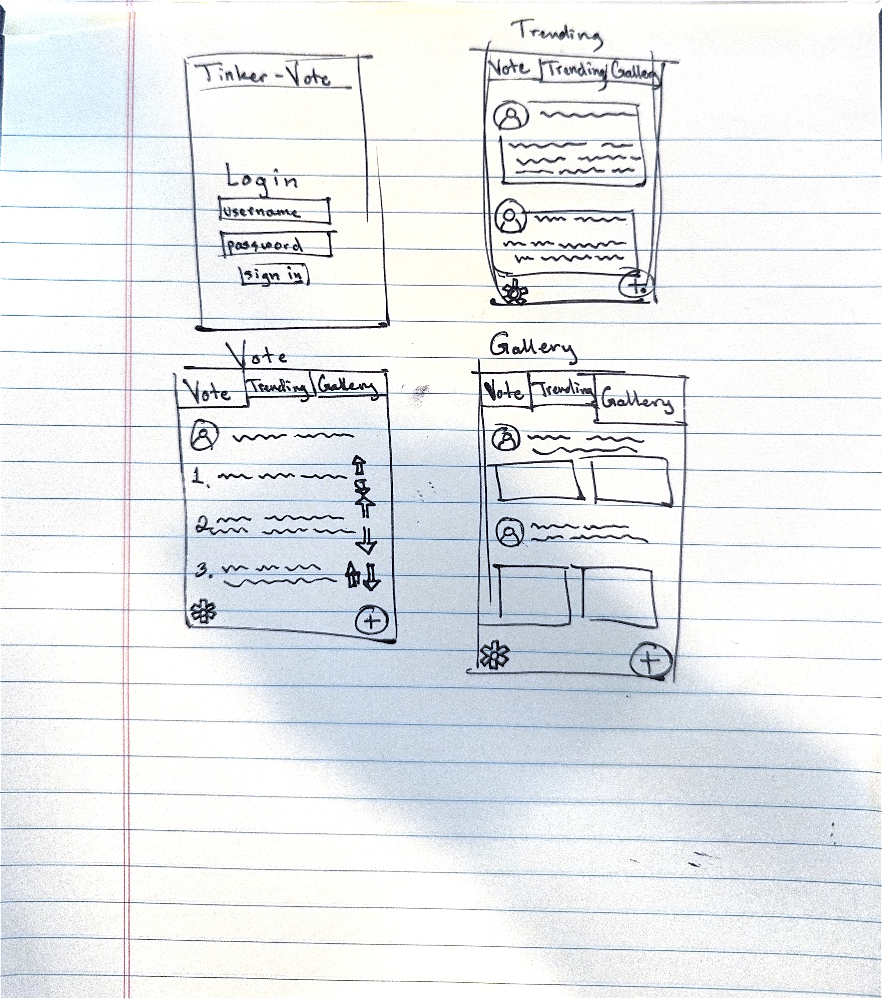
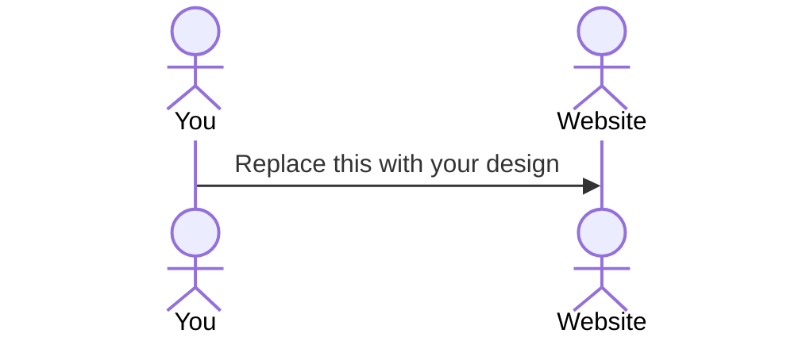

# Tinker-Vote

[My Notes](notes.md)

Tinker-Vote is a simple web application that allows users to vote on a person's next project idea. It gives users a place to post their ideas through text or hyperlink and show it to the public or friends. All ideas are welcome.

## 🚀 Specification Deliverable

For this deliverable I did the following. I checked the box `[x]` and added a description for things I completed.

- [x] Proper use of Markdown
- [x] A concise and compelling elevator pitch
- [x] Description of key features
- [x] Description of how you will use each technology
- [ ] One or more rough sketches of your application. Images must be embedded in this file using Markdown image references.

### Elevator pitch

Tinker-Vote is a collaborative hub for makers, gamers, and hardware enthusiasts to decide their next big project. Users can post potential "Build Ideas"—ranging from custom Minecraft server rigs to Raspberry Pi smart mirrors—and let the community vote on which one should be tackled next. Additionally, a "Showcase Gallery" allows creators to share links to their completed builds, providing inspiration and proof of concept. It turns the solitary hobby of tinkering into a social, data-driven experience where the best ideas rise to the top in real-time.

### Design

There are 4 views, login, vote, trending, and gallery. Login will allow the user to enter their credentials and if they don't have an account, sign up. In vote users can upvote or downvote the next ideas for someone to make and tinker with. Trending shows the most views posts that are being voted on. Gallery is a view of everyones completed projects.

### Key features

- Sercure login with password encryption
- Voting and project selection
- Posting projects to vote on
- Preferences like units or light and dark mode
- Treading page based on posts with most traffic
- Gallery for completes projects
- Commenting on posts

### Technologies

I am going to use the required technologies in the following ways.

- **HTML** - A simple interface built with html with only the necessary UI elements.  A Dashboard for trending ideas, a Voting Page, and a Showcase Gallery for completed projects.
- **CSS** - Use a simple but beautiful flexbox/grid setup for a pleasing user interface.
- **React** - One page with three different views for the trending ideas, voting page, and gallery.
- **Service** - Using endpoints for voting, checking votes, authentication, and login/logout.
- **DB/Login** - Stores authentication for users and preferences like light or dark mode.
- **WebSocket** - Voting will be done in realtime. When a user votes on a project idea, a message will be broadcast to all users and immediately updated.

## 🚀 AWS deliverable

For this deliverable I did the following. I checked the box `[x]` and added a description for things I completed.

- [ ] **Server deployed and accessible with custom domain name** - [My server link](https://yourdomainnamehere.click).

## 🚀 HTML deliverable

For this deliverable I did the following. I checked the box `[x]` and added a description for things I completed.

- [ ] **HTML pages** - I did not complete this part of the deliverable.
- [ ] **Proper HTML element usage** - I did not complete this part of the deliverable.
- [ ] **Links** - I did not complete this part of the deliverable.
- [ ] **Text** - I did not complete this part of the deliverable.
- [ ] **3rd party API placeholder** - I did not complete this part of the deliverable.
- [ ] **Images** - I did not complete this part of the deliverable.
- [ ] **Login placeholder** - I did not complete this part of the deliverable.
- [ ] **DB data placeholder** - I did not complete this part of the deliverable.
- [ ] **WebSocket placeholder** - I did not complete this part of the deliverable.

## 🚀 CSS deliverable

For this deliverable I did the following. I checked the box `[x]` and added a description for things I completed.

- [ ] **Visually appealing colors and layout. No overflowing elements.** - I did not complete this part of the deliverable.
- [ ] **Use of a CSS framework** - I did not complete this part of the deliverable.
- [ ] **All visual elements styled using CSS** - I did not complete this part of the deliverable.
- [ ] **Responsive to window resizing using flexbox and/or grid display** - I did not complete this part of the deliverable.
- [ ] **Use of a imported font** - I did not complete this part of the deliverable.
- [ ] **Use of different types of selectors including element, class, ID, and pseudo selectors** - I did not complete this part of the deliverable.

## 🚀 React part 1: Routing deliverable

For this deliverable I did the following. I checked the box `[x]` and added a description for things I completed.

- [ ] **Bundled using Vite** - I did not complete this part of the deliverable.
- [ ] **Components** - I did not complete this part of the deliverable.
- [ ] **Router** - I did not complete this part of the deliverable.

## 🚀 React part 2: Reactivity deliverable

For this deliverable I did the following. I checked the box `[x]` and added a description for things I completed.

- [ ] **All functionality implemented or mocked out** - I did not complete this part of the deliverable.
- [ ] **Hooks** - I did not complete this part of the deliverable.

## 🚀 Service deliverable

For this deliverable I did the following. I checked the box `[x]` and added a description for things I completed.

- [ ] **Node.js/Express HTTP service** - I did not complete this part of the deliverable.
- [ ] **Static middleware for frontend** - I did not complete this part of the deliverable.
- [ ] **Calls to third party endpoints** - I did not complete this part of the deliverable.
- [ ] **Backend service endpoints** - I did not complete this part of the deliverable.
- [ ] **Frontend calls service endpoints** - I did not complete this part of the deliverable.
- [ ] **Supports registration, login, logout, and restricted endpoint** - I did not complete this part of the deliverable.

## 🚀 DB deliverable

For this deliverable I did the following. I checked the box `[x]` and added a description for things I completed.

- [ ] **Stores data in MongoDB** - I did not complete this part of the deliverable.
- [ ] **Stores credentials in MongoDB** - I did not complete this part of the deliverable.

## 🚀 WebSocket deliverable

For this deliverable I did the following. I checked the box `[x]` and added a description for things I completed.

- [ ] **Backend listens for WebSocket connection** - I did not complete this part of the deliverable.
- [ ] **Frontend makes WebSocket connection** - I did not complete this part of the deliverable.
- [ ] **Data sent over WebSocket connection** - I did not complete this part of the deliverable.
- [ ] **WebSocket data displayed** - I did not complete this part of the deliverable.
- [ ] **Application is fully functional** - I did not complete this part of the deliverable.
